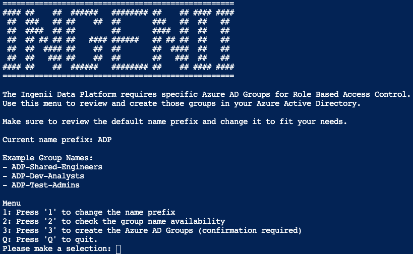

# Data Platform: Azure AD Groups Creation

## Description

Some customers feel more comfortable creating the Azure AD groups required by our Data Platform manually.
We are providing a script that can be used interactively from the Azure Cloud Shell.

## Prerequisites

You must have access to the Azure Cloud Shell and have the necessary permissions to create Azure AD groups.

## Usage

Open the [Azure Cloud Shell](https://docs.microsoft.com/en-us/azure/cloud-shell/overview)

Run the following command

```powershell
iex ((New-Object System.Net.WebClient).DownloadString('https://raw.githubusercontent.com/ingenii-solutions/public/main/scripts/data-platform/azuread-groups-creation/script.ps1'))
```

Use the interactive menu



## Results

The script will let you review and create the required Azure AD groups.

You will also have a chance to choose the group name `prefix`.

As of today, we are creating the following groups:

- `prefix`-Shared-Admins
- `prefix`-Shared-Engineers
- `prefix`-Shared-Analysts
- `prefix`-Dev-Admins
- `prefix`-Dev-Engineers
- `prefix`-Dev-Analysts
- `prefix`-Test-Admins
- `prefix`-Test-Engineers
- `prefix`-Test-Analysts
- `prefix`-Prod-Admins
- `prefix`-Prod-Engineers
- `prefix`-Prod-Analysts
